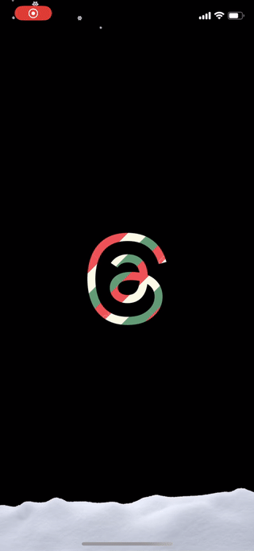

# SnowyThreads

This is just a little fun project I made to try and recreate the snowy effect that was added to Threads during the holidays. It uses the device motion to change the direction of the snow falling, and also has a little parallax effect with the logo to visualize the device tilt. Enjoy.

Threads version:

My version:

